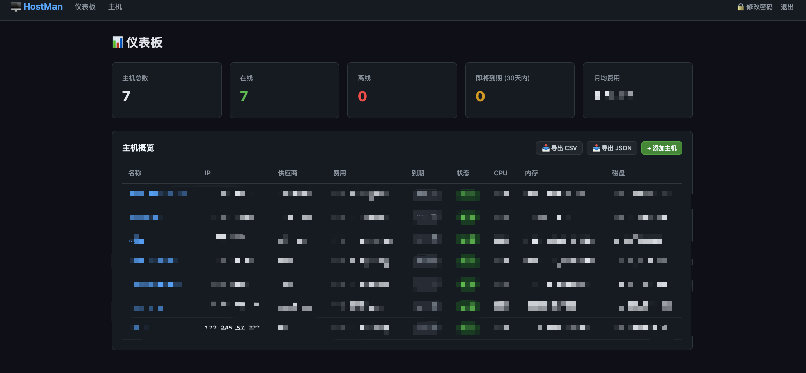
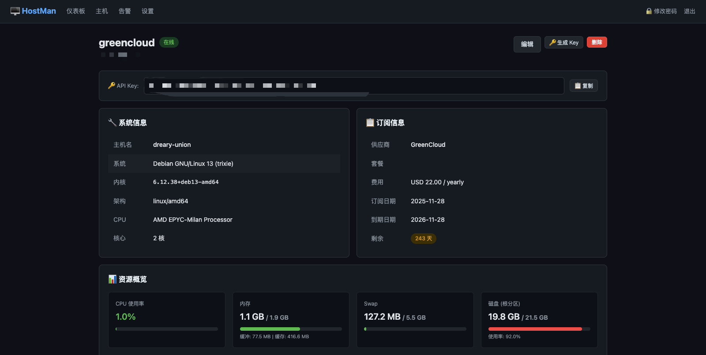
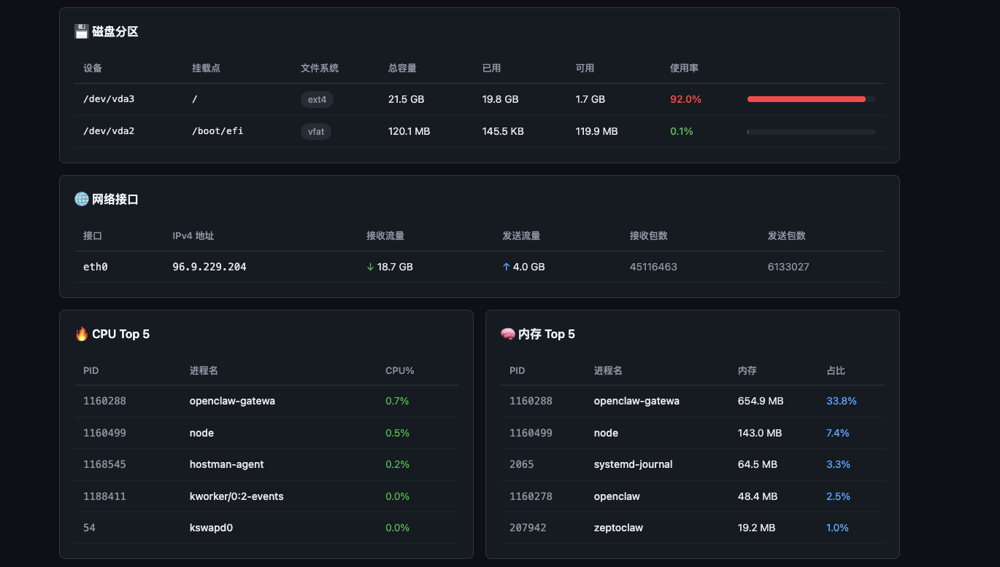
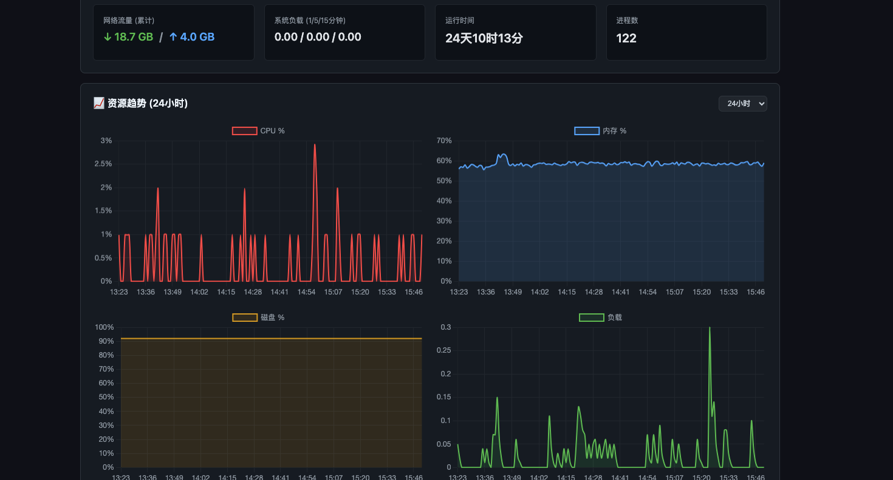
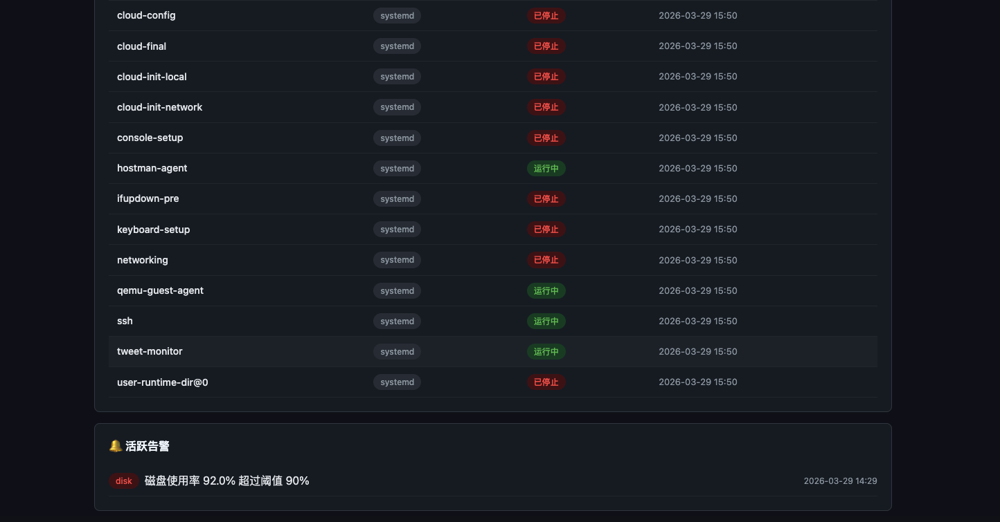

# HostMan 🖥️

[🇬🇧 English](README_EN.md)

轻量级主机管理系统 — 订阅管理 · 资源监控 · 告警推送 · 命令行工具

> 纯 Go 实现，单二进制部署，SQLite 存储，零外部依赖。

## 📸 系统截图

### 仪表板



### 主机详情

| 系统信息 | 磁盘 / 网络 / CPU / 内存 |
|:---:|:---:|
|  |  |

| 资源趋势图表 | 进程 / 告警 |
|:---:|:---:|
|  |  |

## ✨ 功能特性

### 📋 主机管理
- 主机信息 CRUD（名称、IP、供应商、套餐、备注）
- 订阅跟踪（费用、计费周期、订阅/到期日期）
- 月均费用统计（自动折算月付/季付/年付）
- 主机信息 CSV / JSON 导出

### 📊 资源监控
- Agent 自动采集：CPU / 内存 / 磁盘 / 网络 / 负载 / 进程
- 服务状态监控：systemd 服务 + Docker 容器
- 主机静态信息：操作系统、内核、CPU 型号、架构
- 离线检测（心跳超时自动标记）
- 历史指标清理（默认保留 7 天）

### 📈 数据可视化
- 资源历史趋势图（Chart.js）
- 支持 6 小时 / 24 小时 / 3 天 / 7 天时间范围
- CPU、内存、磁盘、负载四维度图表

### 🔔 告警系统
- 自动检测：CPU / 内存 / 磁盘超阈值、订阅到期
- 阈值可配置（Web 设置页面）
- 条件恢复自动解除告警
- 同类型告警去重

### 📱 Telegram 通知
- 告警触发自动推送到 Telegram
- Web 界面配置 Bot Token / Chat ID
- 一键测试消息验证配置

### 🖥️ CLI 命令行工具
- `hostman-cli status` — 仪表板概览
- `hostman-cli list` — 主机列表（含资源状态）
- `hostman-cli show <名称>` — 主机详情
- `hostman-cli alerts` — 活跃告警
- `hostman-cli export csv|json` — 导出

### 🔐 安全
- 登录认证（bcrypt 密码 + Cookie Session）
- HTTPS 支持（自签名证书 / Let's Encrypt）
- API Key 认证（Agent 上报）
- Admin API Token 认证（CLI 访问）

## 🏗️ 架构

```
┌──────────────┐     HTTPS :443      ┌──────────────────┐
│   浏览器      │◄──────────────────►│   Server          │
└──────────────┘                     │  · Web 仪表板     │
                                     │  · REST API       │
┌──────────────┐     HTTP :8080      │  · 告警检测       │
│ Agent (本机)  │───────────────────►│  · SQLite 存储    │
└──────────────┘     localhost       └──────────────────┘
                                           ▲
┌──────────────┐     HTTPS :443            │
│ Agent (远程)  │──────────────────────────┘
└──────────────┘     insecure mode

┌──────────────┐     Admin API
│ CLI 工具      │──────────────────────────►
└──────────────┘     Bearer Token
```

## 🚀 快速开始

### 环境要求

- Go 1.22+（编译）
- GCC（CGO，SQLite 需要）
- Linux（Agent 读取 `/proc`）

### 编译

```bash
git clone https://github.com/hjw21century/HostMan.git
cd HostMan

# 编译全部
make build

# 或者分别编译
CGO_ENABLED=1 go build -o bin/hostman-server ./cmd/server
CGO_ENABLED=1 go build -o bin/hostman-agent  ./cmd/agent
CGO_ENABLED=0 go build -o bin/hostman-cli    ./cmd/cli
```

### 部署 Server

```bash
# 创建目录
mkdir -p /opt/hostman/data /opt/hostman/tls /opt/hostman/web/templates

# 复制文件
cp bin/hostman-server /opt/hostman/
cp web/templates/*.html /opt/hostman/web/templates/

# 生成自签名证书（可选，用于 HTTPS）
openssl req -x509 -newkey ec -pkeyopt ec_paramgen_curve:prime256v1 \
  -keyout /opt/hostman/tls/key.pem -out /opt/hostman/tls/cert.pem \
  -days 3650 -nodes -subj "/CN=HostMan" \
  -addext "subjectAltName=IP:你的服务器IP"

# 启动
/opt/hostman/hostman-server \
  -db /opt/hostman/data/hostman.db \
  -templates /opt/hostman/web/templates \
  -tls-cert /opt/hostman/tls/cert.pem \
  -tls-key /opt/hostman/tls/key.pem
```

默认管理员账号：`admin` / `admin`（请登录后立即修改密码）

### 部署 Agent

**本机 Agent（与 Server 同机）：**

```bash
cp bin/hostman-agent /opt/hostman/

# 创建配置
mkdir -p /etc/hostman
cat > /etc/hostman/agent.json << 'EOF'
{
  "server": "http://127.0.0.1:8080",
  "api_key": "从Web界面获取",
  "interval": 60,
  "insecure": false
}
EOF

/opt/hostman/hostman-agent
```

**远程 Agent（其他机器）：**

```bash
# 使用一键安装脚本
curl -sL https://你的服务器/install-agent.sh | bash

# 或手动安装
scp bin/hostman-agent 目标机器:/opt/hostman/

# 远程配置（自签名证书需要 insecure: true）
cat > /etc/hostman/agent.json << 'EOF'
{
  "server": "https://你的服务器IP",
  "api_key": "从Web界面获取",
  "interval": 60,
  "insecure": true
}
EOF
```

### 配置 CLI

```bash
cp bin/hostman-cli /usr/local/bin/

# 交互式配置
hostman-cli config
# 输入服务器地址: https://你的IP
# 输入API Token: 从 Web 设置页面生成
# 跳过TLS验证: y（自签名证书时）
```

## ⚙️ 命令行参数

### Server

| 参数 | 默认值 | 说明 |
|------|--------|------|
| `-addr` | `:8080` | HTTP 监听地址 |
| `-db` | `hostman.db` | SQLite 数据库路径 |
| `-templates` | 自动检测 | 模板目录 |
| `-tls-cert` | - | TLS 证书路径 |
| `-tls-key` | - | TLS 私钥路径 |
| `-offline-timeout` | `3m` | 心跳超时（标记离线） |
| `-purge-age` | `168h` | 指标保留时间 |
| `-debug` | `false` | 调试模式 |

### Agent

配置文件：`/etc/hostman/agent.json`

```json
{
  "server": "http://127.0.0.1:8080",
  "api_key": "your-api-key",
  "interval": 60,
  "insecure": false
}
```

### CLI

配置文件：`~/.hostman-cli.json`

```
hostman-cli config              配置服务器和Token
hostman-cli status              仪表板概览
hostman-cli list                主机列表
hostman-cli show <ID|名称>      主机详情
hostman-cli alerts              活跃告警
hostman-cli export [csv|json]   导出主机信息
```

## 📡 API

### Agent 上报

```bash
curl -X POST https://server/api/v1/report \
  -H "X-API-Key: YOUR_KEY" \
  -H "Content-Type: application/json" \
  -d '{
    "metric": {
      "cpu_percent": 45.2,
      "mem_total": 8589934592,
      "mem_used": 4294967296,
      "disk_total": 107374182400,
      "disk_used": 53687091200,
      "load_1": 1.5, "load_5": 1.2, "load_15": 0.9,
      "net_in": 1048576, "net_out": 524288,
      "uptime": 864000
    },
    "services": [
      {"name": "nginx", "type": "systemd", "status": "running"},
      {"name": "redis", "type": "docker", "status": "running"}
    ]
  }'
```

### Admin API（CLI 使用）

所有 Admin API 需要 `Authorization: Bearer <token>` 头。

| 方法 | 路径 | 说明 |
|------|------|------|
| GET | `/api/v1/admin/status` | 仪表板概览 |
| GET | `/api/v1/admin/hosts` | 主机列表（含最新指标） |
| GET | `/api/v1/admin/hosts/:id` | 主机详情 |
| GET | `/api/v1/admin/alerts` | 活跃告警列表 |
| GET | `/api/v1/admin/export?format=csv` | 导出主机信息 |

### 查询主机

```bash
curl https://server/api/v1/hosts
curl https://server/api/v1/hosts/1
```

## 📁 项目结构

```
hostman/
├── cmd/
│   ├── server/main.go        # Server 入口
│   ├── agent/main.go         # Agent 入口
│   └── cli/main.go           # CLI 入口
├── internal/
│   ├── model/model.go        # 数据模型
│   ├── store/sqlite.go       # SQLite 数据层
│   ├── handler/handler.go    # HTTP 处理器 + API
│   ├── agent/collector.go    # 资源采集器
│   ├── middleware/auth.go    # 认证中间件
│   └── notify/telegram.go   # Telegram 通知
├── web/templates/            # HTML 模板（暗色主题）
│   ├── layout.html           # 布局模板
│   ├── dashboard.html        # 仪表板
│   ├── hosts.html            # 主机列表
│   ├── host_detail.html      # 主机详情 + 图表
│   ├── host_form.html        # 主机编辑
│   ├── alerts.html           # 告警记录
│   ├── settings.html         # 系统设置
│   ├── change_password.html  # 修改密码
│   └── login.html            # 登录页面
├── scripts/install.sh        # Agent 一键安装脚本
├── Makefile
├── go.mod
└── README.md
```

## 🛠️ 技术栈

| 组件 | 技术 |
|------|------|
| 语言 | Go |
| Web 框架 | Gin |
| 数据库 | SQLite (go-sqlite3) |
| 前端图表 | Chart.js |
| 密码哈希 | bcrypt |
| 通知 | Telegram Bot API |
| TLS | crypto/tls |

## 📝 开发路线

- [x] **Phase 1**: Server + SQLite + 主机 CRUD + 订阅管理 + Web 仪表板
- [x] **Phase 2**: Agent 资源采集 + 心跳上报 + 服务监控
- [x] **Phase 3**: 资源历史图表 + 趋势分析 (Chart.js)
- [x] **Phase 4**: 告警系统 + Telegram 通知
- [x] **Phase 5**: CLI 命令行工具 + Admin API
- [ ] **Phase 6**: 多用户权限管理
- [ ] **Phase 7**: 主机分组 / 标签
- [ ] **Phase 8**: 自定义监控项 + 插件系统

## 📄 License

MIT
